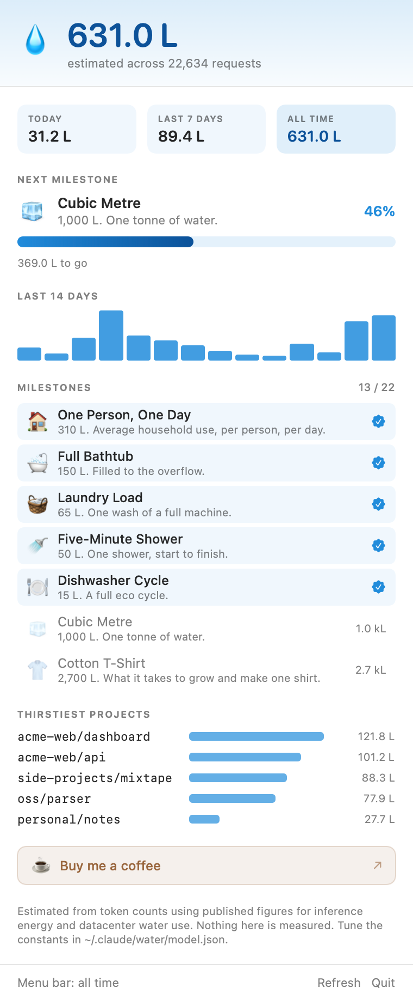

# Thirsty 💧

Claude Code, but the thinking spinner tells you how much water the request is drinking.

```
Boiling off 27 mL…  (12s · ↑ 1.4k tokens · esc to interrupt)
Sipping 25 mL · 783 mL this session…  (4s · esc to interrupt)
```

And a menu bar app that keeps the running total, with milestones to unlock.



| | |
|---|---|
| **`WaterBar/`** | macOS menu bar app. Universal binary, no dependencies. |
| **`plugin/`** | Claude Code plugin. Rewrites the spinner verb after every request. |

---

## Install

### WaterBar (the menu bar app)

```bash
brew install --cask bmoresca/tap/waterbar
```

Or grab `WaterBar-x.y.z.dmg` from [Releases](https://github.com/bmoresca/waterbar/releases)
and drag it to Applications.

> **First launch, DMG only.** WaterBar is ad-hoc signed — there's no paid Apple
> Developer membership behind it — so macOS blocks it the first time.
>
> On **macOS 15 Sequoia and later**, open **System Settings → Privacy & Security**,
> scroll to Security, and click **Open Anyway** next to the message about
> WaterBar. (Apple removed the old Control-click → Open shortcut in Sequoia.)
> On macOS 13–14, Control-click WaterBar in Applications → **Open** → **Open**.
>
> Either way it's once, not every launch. Or in Terminal:
> `xattr -dr com.apple.quarantine /Applications/WaterBar.app`
>
> **Homebrew avoids all of this** — the cask clears the quarantine flag for you.

macOS 13 or later, Intel or Apple silicon. It reads the transcripts Claude Code
already writes to `~/.claude/projects` — nothing to configure, and your whole
history is counted the first time it runs.

To start it at login: System Settings → General → Login Items → **+**.

### The plugin (optional)

WaterBar rewrites the spinner on its own every 20 seconds. The plugin does it
the instant a request lands, and adds the slash commands.

```
/plugin marketplace add https://github.com/bmoresca/waterbar
/plugin install thirsty@thirsty-marketplace
```

`/water` for the ledger · `/water-off` to restore Claude's normal verbs ·
`/water-on` to bring the water back · `/water-reset confirm` to zero it.

---

## How it works

Claude Code writes every API response — with its token usage attached — to
`~/.claude/projects/<project>/<session>.jsonl`. WaterBar tails those files,
prices each request in millilitres, and appends the result to a ledger at
`~/.claude/water/ledger.jsonl`.

The spinner trick uses `spinnerVerbs`, a real Claude Code setting:

```json
"spinnerVerbs": { "mode": "replace", "verbs": ["Boiling off 27 mL", "Sipping 25 mL"] }
```

Claude Code watches its settings files and picks a verb fresh at the start of
every turn. So rewriting that list after each request makes the spinner report
live numbers. Only that one key is ever touched, and a copy of your settings is
saved as `settings.json.before-water` the first time.

**The number is a nowcast, not a prediction.** Nothing can know what a request
will cost before it runs, so the spinner shows what the *previous* request
actually cost, jittered a little so it moves. That's the honest version of the
joke.

---

## The numbers

Every figure here is an **estimate assembled from public research**. Anthropic
does not publish per-request water use, and even if it did it would vary by
datacenter, season, and grid. Nothing in this project is measured.

The chain is:

```
tokens → watt-hours → kWh (× PUE) → litres (× on-site cooling + grid water)
```

Defaults, all editable in `~/.claude/water/model.json`:

| Constant | Default | Where it comes from |
|---|---|---|
| Opus output | 3.00 Wh / 1k tokens | Scaled up from the public mid-size figures below |
| Sonnet output | 1.10 Wh / 1k tokens | " |
| Fable output | 0.60 Wh / 1k tokens | " |
| Haiku output | 0.30 Wh / 1k tokens | " |
| Input tokens | ~1/30th of output | Prefill is one parallel pass; each output token is its own forward pass |
| Cache reads | ~1/200th of output | The KV state already exists; it only has to move |
| PUE | 1.10 | Typical hyperscale datacenter overhead |
| On-site cooling | 1.80 L / kWh | US datacenter water use efficiency (LBNL) |
| Grid electricity | 3.10 L / kWh | Water spent generating the power itself |

Anchors those defaults were fitted between:

- **Google, "Measuring the environmental impact of AI inference" (2025)** —
  median Gemini text prompt ≈ 0.24 Wh, ≈ 0.26 mL. The optimistic end: a small,
  heavily optimised model on a short prompt.
- **Li et al., "Making AI Less Thirsty" (2023)** — GPT-3-scale inference at
  roughly 500 mL per 10–50 responses. The pessimistic end.

A heavy agentic Opus turn lands around **20–30 mL**. If you think that's wrong,
it probably is — change the constants and run `WaterBar rebuild`.

---

## Milestones

💧 First Drop · 🧪 Eye Dropper · ☕ Espresso Shot · 🥃 A Glass of Water ·
🥤 The Bottle · 💦 Litre Club · 🪣 Gallon Guzzler · 🚽 Toilet Flush ·
🍽 Dishwasher Cycle · 🚿 Five-Minute Shower · 🧺 Laundry Load · 🛁 Full Bathtub ·
🏠 One Person, One Day · 🧊 Cubic Metre · 👕 Cotton T-Shirt · 👖 One Pair of Jeans ·
🐄 One Kilo of Beef · 🚛 Tanker Truck · 🏖 Backyard Pool · 🏢 Water Tower ·
🏊 Olympic Pool · 🌊 Reservoir

They arrive as notifications.

---

## Buy me a coffee

The popover carries an optional support button. It's hidden until a link is
configured, so a fork never ships a dead button. To point it somewhere:

```swift
// WaterBar/Sources/WaterBar/Engine/SupportLink.swift
static let builtIn = "https://buy.stripe.com/xxxxxxxxxxxx"
```

Or, without rebuilding, set `support_url` in `~/.claude/water/config.json`.
Only `https://` URLs are accepted.

The link itself is a **Stripe Payment Link** with *Customer chooses what to pay*
turned on — Stripe Dashboard → Payment Links → New → set a suggested amount and
a minimum. Nothing is embedded in the app: the button opens the browser, and
WaterBar never sees a payment, a customer, or a cent.

## CLI

The app binary is also a CLI:

```bash
alias waterbar=/Applications/WaterBar.app/Contents/MacOS/WaterBar

waterbar report        # the markdown report
waterbar status        # everything, as JSON
waterbar spinner-off   # restore Claude's normal verbs
waterbar rebuild       # recompute totals after editing model.json
waterbar reset         # back to zero
waterbar paths         # where everything lives
```

There's a statusline too, if you'd rather have the number pinned than in the
spinner — in `~/.claude/settings.json`:

```json
"statusLine": {
  "type": "command",
  "command": "/Applications/WaterBar.app/Contents/MacOS/WaterBar statusline"
}
```

---

## Building from source

```bash
bash WaterBar/package.sh        # universal .app + DMG in dist/
bash scripts/parity-check.sh    # assert both engines agree
```

Needs macOS 13+, a Swift toolchain, and `brew install create-dmg` for the styled
DMG window. See [docs/DISTRIBUTION.md](docs/DISTRIBUTION.md) for signing,
notarization, the Homebrew tap, and how to cut a release.

## Files

```
WaterBar/
  Sources/WaterBar/           SwiftUI menu bar app
  Sources/WaterBar/Engine/    the ledger, the model, the spinner, the CLI
  build.sh                    universal .app, signed as well as it can be
  package.sh                  ...wrapped in a DMG
plugin/
  hooks/water-hook.sh         prefers WaterBar's engine, falls back to Python
  engine/water.py             the portable engine (Linux, Windows, no app)
  commands/                   /water /water-on /water-off /water-reset
Casks/waterbar.rb             the Homebrew cask
scripts/release.sh            version, build, tag, publish, update the cask
scripts/parity-check.sh       assert the two engines stay identical
~/.claude/water/
  model.json                  the constants above
  config.json                 spinner on/off, which settings file to write
  ledger.jsonl                one line per request
  state.json                  running totals
  achievements.json           when each milestone fell
```
